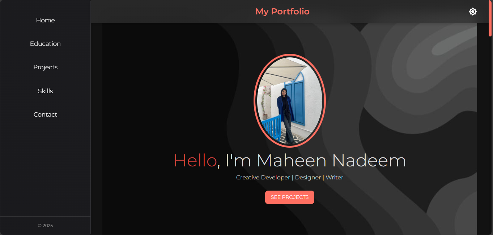
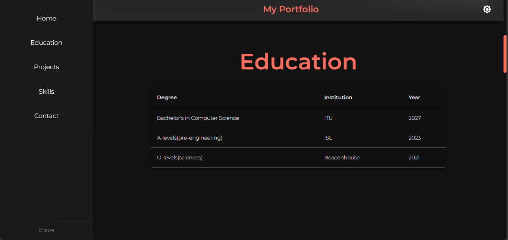
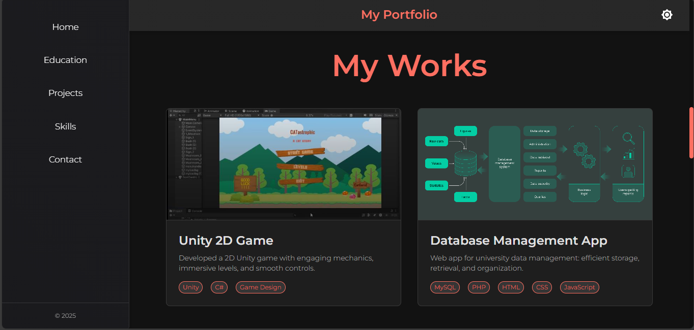
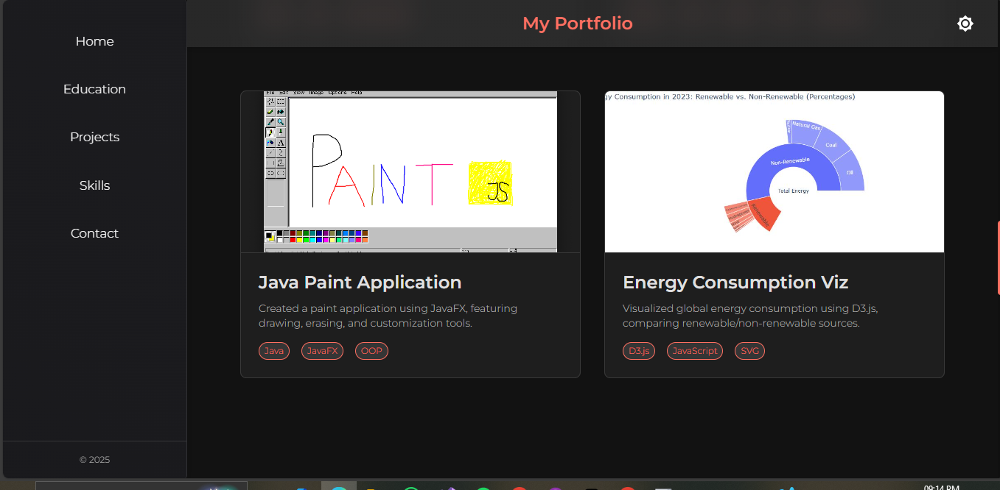
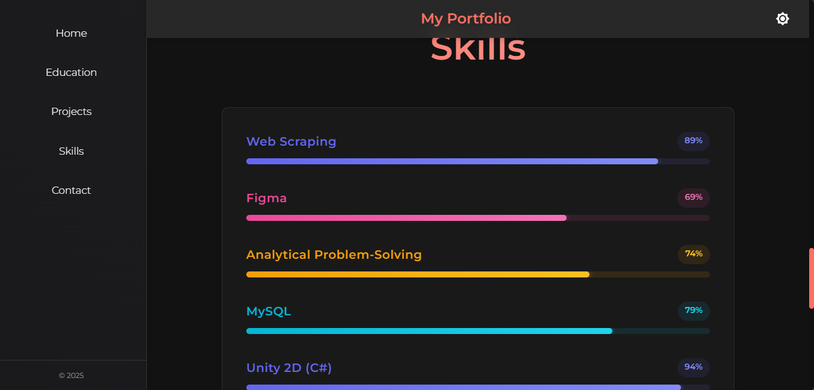
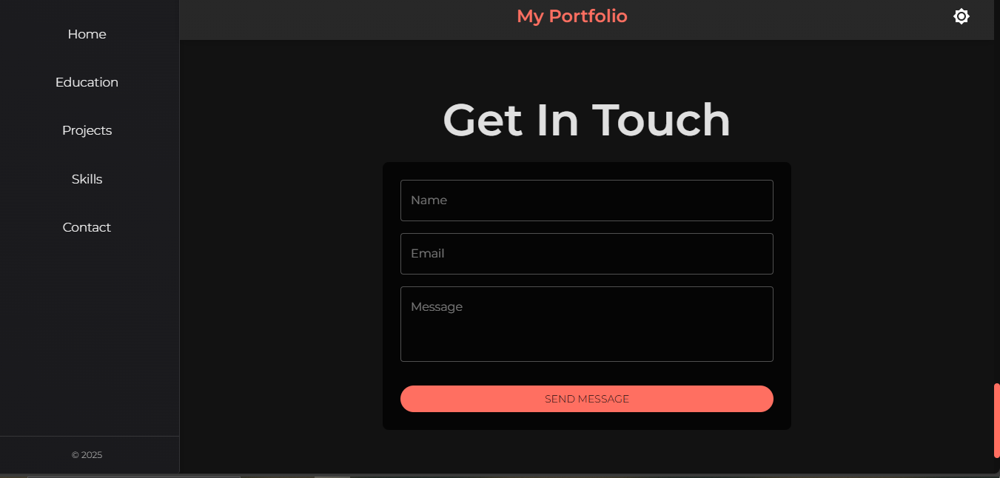

# React Portfolio Website

A modern, responsive portfolio website built with React and Material-UI featuring a clean design with both light and dark modes.

## Features

- **Responsive Design**: Fully responsive layout that works on mobile, tablet, and desktop devices
- **Light/Dark Mode**: Toggle between light and dark themes with persistent user preference
- **Fixed Navigation**: Navbar sticks to the top while scrolling for easy access
- **Collapsible Sidebar**: Mobile-friendly navigation that opens and closes on demand
- **Project Cards**: Visual display of projects with hover effects and technology tags
- **Education Timeline**: Clean table-based display of educational background
- **Skills Section**: Visual representation of technical skills
- **Contact Form**: Easy way for visitors to reach out
- **Smooth Scrolling**: Seamless navigation between sections
- **Custom Theming**: Carefully designed color palette for both light and dark modes
- **Material Design**: Modern UI components following Material Design principles

## Usage

### Navigation

The website features a navigation bar at the top that allows users to access different sections. On mobile devices, the navigation collapses into a sidebar menu accessible via a hamburger icon.

### Theme Toggle

Users can switch between light and dark modes by clicking the theme toggle button in the navigation bar. The selected theme is saved to the browser's local storage for persistence between visits.

### Projects Section

The Projects section displays cards for each project with:
- Project image
- Title and description
- Technology tags
- Hover effects for enhanced interactivity

### Education Section

The Education section presents academic qualifications in a clean, tabular format with:
- Degree/certificate
- Institution
- Year of completion

### Responsive Design

The website is fully responsive and adapts to different screen sizes:
- Desktop: Full layout with expanded navigation
- Tablet: Adapted layout with optimized spacing
- Mobile: Condensed layout with collapsible sidebar navigation

## Screenshots

### Home Page

### Education Page

### Projects Page

### Skills Page

### Contact Page

